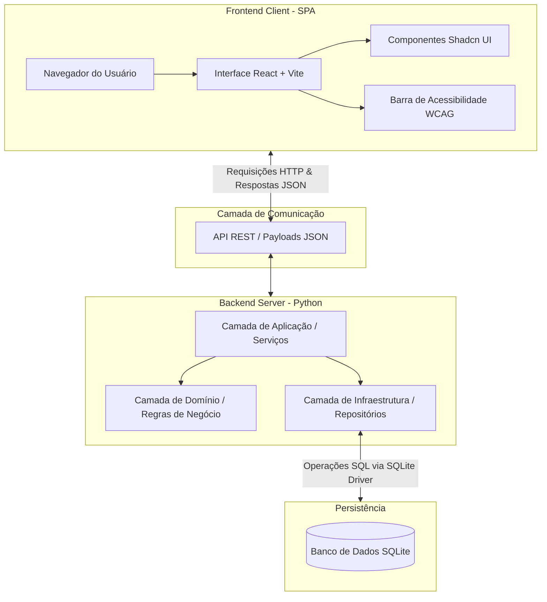
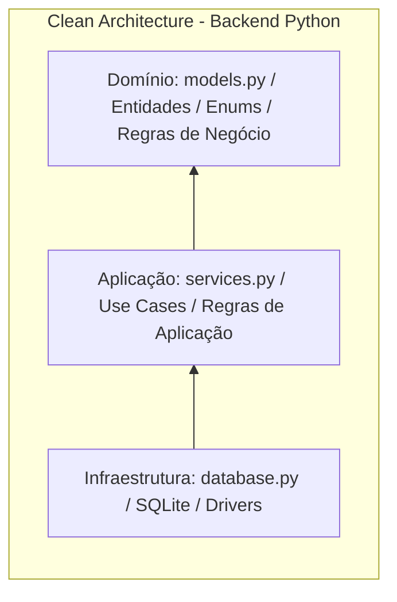
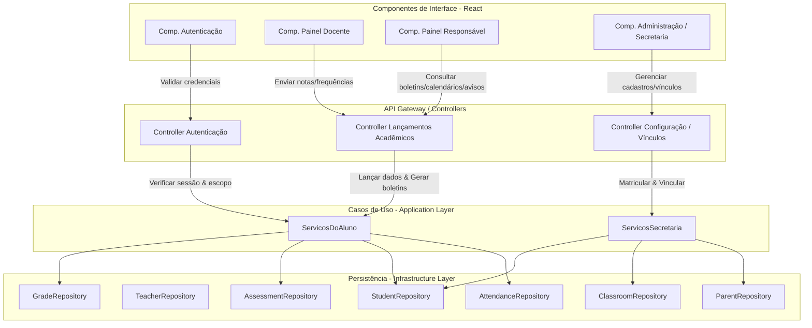
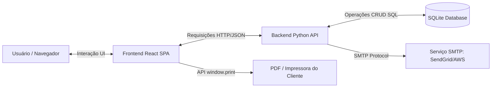
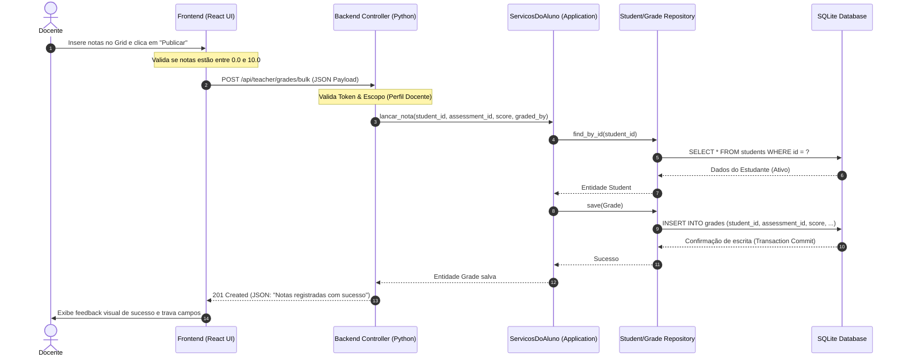

<!-- markdownlint-disable MD013 -->

# TrAcEs - Modelo Arquitetural do MVP Web

Este documento apresenta a especificação e o modelo arquitetural do MVP Web do projeto **TrAcEs - Trilha de Acompanhamento Escolar**. Ele serve como o guia e manual de engenharia do sistema, demonstrando como a aplicação está estruturada de forma a atender aos requisitos de qualidade, usabilidade, acessibilidade e separação de conceitos.

---

## 1. Visão Geral da Arquitetura

O sistema **TrAcEs (Trilha de Acompanhamento Escolar)** foi projetado para atuar como uma ponte digital entre o ambiente escolar e os lares. Abaixo é descrita a contextualização do problema, o propósito do MVP, a definição dos usuários e a organização geral.

### Problema

O acompanhamento escolar contínuo de crianças e adolescentes pelos seus pais ou responsáveis legais é frequentemente prejudicado pela descentralização e indisponibilidade de dados. Escolas de pequeno porte e projetos sociais costumam utilizar processos manuais ou planilhas isoladas, gerando gargalos de comunicação. A falta de um canal acessível e centralizado para consulta de frequência, notas e avisos escolares contribui para a identificação tardia de problemas como o risco de evasão escolar ou o baixo rendimento pedagógico.

### Objetivo do MVP

O objetivo primordial deste MVP (Minimum Viable Product) é validar uma interface web focada na experiência do usuário (UX) e acessibilidade prática (WCAG 2.1 AA), permitindo:

1. Que o **corpo docente** lance notas e registros de frequência de forma ágil, segura e em tempo real.
2. Que os **responsáveis legais** acompanhem de forma simplificada e centralizada a rotina escolar, assiduidade e médias pedagógicas de seus dependentes.

### Usuários do Sistema

O sistema é desenhado para atender a três perfis principais:

* **Responsáveis Legais (Pais/Tutores):** Usuários que buscam uma visualização rápida e intuitiva da situação escolar dos filhos. Este perfil exige altíssima acessibilidade, com suporte a magnificação de fontes, temas de alto contraste e legibilidade imediata (baixo letramento digital).
* **Docentes (Professores):** Usuários focados na produtividade e precisão. Necessitam de telas operacionais eficientes para o lançamento em lote de dados acadêmicos, com validação de dados em tempo real para prevenção de erros.
* **Administradores / Secretaria (Escopo de suporte):** Responsáveis pela configuração inicial, matriculando alunos, associando turmas e vinculando responsáveis aos respectivos estudantes.

### Organização Geral

O sistema adota o modelo de arquitetura **Cliente-Servidor** desacoplado, operando com uma clara separação entre a interface visual e a lógica de processamento de dados:

* **Frontend (Cliente):** Uma Single Page Application (SPA) que processa e renderiza a interface do usuário localmente no navegador, minimizando o tráfego de rede e garantindo transições de tela instantâneas.
* **Backend (Servidor):** Um servidor estruturado sob os princípios da *Clean Architecture*, responsável por processar as regras de negócio acadêmicas e expor APIs estruturadas.
* **Comunicação:** Ocorre exclusivamente por meio de requisições baseadas em protocolo HTTP utilizando payloads padronizados em formato JSON.

---

## 2. Modelo Arquitetural do Sistema

Esta seção apresenta a modelagem técnica do sistema, detalhando a divisão estrutural da aplicação e os fluxos de informação.

### a) Estrutura em Camadas

A divisão arquitetural do TrAcEs foi projetada sob o princípio da separação de preocupações (SoC), garantindo manutenibilidade e flexibilidade tecnológica. A estrutura é dividida em três grandes blocos:

1. **Frontend (Cliente - Camada de Apresentação)**
   * **Tecnologia:** React + Vite + Shadcn UI.
   * **Função:** Camada puramente visual que processa o estado local da interface (SPA) e a acessibilidade. As interações do usuário desencadeiam chamadas para APIs de forma assíncrona.

2. **Backend (Servidor - Camada de Aplicação e Negócio)**
   * **Tecnologia:** Python.
   * **Estrutura:** Dividido de acordo com a *Clean Architecture*:
     * **Camada de Domínio (Domain):** Contém as entidades principais (`Student`, `Teacher`, `Parent`, etc.) e enums do negócio. É independente de bibliotecas externas e bancos de dados.
     * **Camada de Aplicação (Application):** Contém as classes de serviço (`ServicosDoAluno`, `ServicosSecretaria`) que implementam as regras e casos de uso da escola (cálculo de médias ponderadas, geração de boletins e consolidação de presenças).
     * **Camada de Infraestrutura (Infrastructure):** Responsável pelos drivers de conexão de banco de dados e implementação do padrão Repository (`StudentRepository`, `GradeRepository`, etc.).

3. **Banco de Dados (Camada de Persistência)**
   * **Tecnologia:** SQLite (Banco de dados relacional local).
   * **Função:** Armazenar os dados estruturados do sistema acadêmico de forma íntegra e transacional.

#### Diagrama de Arquitetura Geral do Sistema

O diagrama a seguir descreve a topologia física e lógica do TrAcEs, evidenciando o desacoplamento entre o cliente e o servidor:



#### Diagrama de Camadas do Backend (Clean Architecture)

A dependência de código corre exclusivamente de fora para dentro, garantindo que o núcleo (Domínio) nunca conheça detalhes da infraestrutura (Banco de Dados, APIs de terceiros):



---

### b) Componentes da Aplicação

O sistema **TrAcEs** é composto por uma série de módulos lógicos que interagem para garantir que a entrada de dados feita pela escola seja refletida de forma segura e acessível para as famílias. A seguir, detalham-se os principais componentes lógicos da aplicação:

1. **Módulo de Autenticação e Controle de Acesso**
   * **Função:** Validar as credenciais de login e definir o escopo de atuação do usuário dentro da aplicação.
   * **Comunicação:** Atua de forma transversal, interceptando as requisições enviadas ao backend. Ao autenticar o usuário, fornece um contexto de sessão (Token JWT ou sessão ativa) indicando se o perfil é `Docente` ou `Responsável`.
   * **Importância:** Garante a segurança do sistema e a privacidade dos dados escolares. Impede que um responsável visualize notas de alunos não vinculados a ele, ou que altere dados acadêmicos, restringindo as ações de escrita exclusivamente ao corpo docente.

2. **Módulo da Secretaria (Administração de Vínculos)**
   * **Função:** Orquestrar o cadastro inicial de entidades e configurar os relacionamentos lógicos do ecossistema escolar.
   * **Comunicação:** Comunica-se diretamente com a camada de serviços (`ServicosSecretaria`) e com a infraestrutura de dados para salvar e listar estudantes, professores e turmas. É responsável por mapear quais alunos pertencem a qual turma e quais responsáveis respondem por quais alunos (tabela de vinculação `student_parent`).
   * **Importância:** Fornece a base de dados estruturada que possibilita o funcionamento de todas as outras telas. Sem a correta amarração de vínculos feita por este componente, o painel do responsável não conseguiria determinar quais dependentes listar no login.

3. **Módulo do Docente (Operações de Escrita)**
   * **Função:** Permitir que o professor regente insira notas e faça a chamada diária (frequência) de forma ágil e em lote.
   * **Comunicação:** Consome dados de escopo (quais turmas e matérias o professor leciona) e envia comandos de gravação para a API de lançamentos acadêmicos. Este componente implementa validações visuais em tempo real antes de enviar os dados (notas entre `0.0` e `10.0` e datas válidas).
   * **Importância:** É a fonte primária de dados dinâmicos do sistema. Alimenta em tempo real as tabelas de notas e presença, desencadeando as notificações que os responsáveis receberão em seus painéis.

4. **Módulo do Responsável (Painel de Leitura e Acompanhamento)**
   * **Função:** Centralizar e consolidar o consumo de dados acadêmicos dos dependentes vinculados ao responsável autenticado.
   * **Comunicação:** Realiza requisições de consulta de leitura à API de serviços do aluno (`ServicosDoAluno`). É estruturado de forma modular no frontend em quatro submódulos principais:
     * **Boletim Escolar:** Exibe tabelas tabulares semânticas com o cálculo final de médias e status de aprovação.
     * **Notas Detalhadas:** Mostra a composição analítica das notas, seus respectivos pesos e a fórmula pedagógica de cálculo.
     * **Frequência e Calendário:** Renderiza o calendário tátil de presenças/faltas e o repositório de justificativas médicas.
     * **Mural de Avisos:** Centraliza comunicados emitidos pela coordenação escolar.
   * **Importância:** É o principal ponto de contato do componente social e extensionista da aplicação, permitindo que famílias acompanhem a evolução pedagógica e ajam preventivamente contra a evasão escolar.

#### Diagrama de Componentes da Aplicação

O diagrama abaixo ilustra o fluxo de dependências e comunicação entre os componentes de interface no frontend, os controladores da API, os serviços de aplicação e os repositórios de dados:



---

### c) Tecnologias Utilizadas

A escolha da pilha de tecnologia do **TrAcEs** foi guiada pela busca de simplicidade no backend, flexibilidade visual no frontend, conformidade estrita com padrões de acessibilidade e viabilidade técnica para rodar em computadores de baixo desempenho (foco extensionista).

| Tecnologia | Função no Projeto | Vantagens e Justificativa Técnica |
| :--- | :--- | :--- |
| **Python 3.10+** | Servidor Backend (Lógica e Regras de Negócio) | Robustez, facilidade no isolamento das camadas da *Clean Architecture* e suporte nativo a tipos numéricos de alta precisão (`Decimal`), essencial para o cálculo correto de médias pedagógicas ponderadas. |
| **React 18** | Biblioteca Frontend (Interface SPA) | Abordagem baseada em componentes altamente reutilizáveis e reativos. Permite atualizar estados pontuais da tela (ex: alteração de tamanho de fonte global ou aplicação de filtros) sem recarregar a página inteira, oferecendo transição imediata e fluida. |
| **Vite** | Bundler e Servidor de Desenvolvimento Frontend | Ferramenta de build de última geração que substitui o antigo *Create React App*. Oferece inicialização do servidor local em milissegundos e *Hot Module Replacement* (HMR) instantâneo, otimizando o fluxo de desenvolvimento. |
| **Shadcn UI** | Biblioteca de Componentes UI | Fornece componentes acessíveis sem estilização fixa (*headless*), baseados no *Radix UI Primitives*. A grande vantagem é o cumprimento nativo das diretrizes WAI-ARIA (operações por teclado completas, compatibilidade nativa com leitores de tela e controle de foco). |
| **TailwindCSS** | Framework CSS Utility-First | Utilizado em conjunto com o Shadcn UI para estilização ágil e responsiva. Permite configurar o tema global e estruturar classes utilitárias para alternância rápida de alto contraste e redimensionamento proporcional de fontes. |
| **SQLite 3** | Banco de Dados Relacional Local | Um motor de banco de dados SQL embutido e livre de configuração de servidores ativos. Armazena todo o histórico escolar em um único arquivo de persistência (`traces.db`), garantindo portabilidade e consumo irrisório de recursos de máquina. |

---

### Manual de Engenharia: Contrato de Integração da API (Frontend ↔ Backend)

Para conectar o Frontend em React e o Backend estruturado em Python, desenhou-se um protocolo de comunicação sem estado (*stateless*) baseado em arquitetura **REST**. Todas as requisições utilizam o cabeçalho `Content-Type: application/json` e trafegam payloads padronizados.

Abaixo, documenta-se o mapeamento das APIs planejadas e modeladas para o MVP:

#### 1. Autenticação e Controle de Sessão

* **Endpoint:** `/api/auth/login`
* **Verbo HTTP:** `POST`
* **Descrição:** Autentica o usuário no sistema e retorna seu papel/permissões (`role`) e os vínculos lógicos de dependentes (se aplicável).
* **Payload de Requisição:**

  ```json
  {
    "email": "ana.santos@email.com",
    "password": "senha_criptografada_aqui"
  }
  ```

* **Payload de Resposta (Sucesso - 200 OK):**

  ```json
  {
    "token": "eyJhbGciOiJIUzI1NiIsInR5cCI6IkpXVCJ9...",
    "user": {
      "id": 2,
      "name": "Ana Santos",
      "role": "PARENT",
      "dependents": [1, 3]
    }
  }
  ```

#### 2. Consulta de Dependentes (Visualização do Responsável)

* **Endpoint:** `/api/parent/dependents`
* **Verbo HTTP:** `GET`
* **Descrição:** Retorna a listagem sintética e os indicadores de todos os filhos vinculados ao responsável autenticado.
* **Payload de Resposta (Sucesso - 200 OK):**

  ```json
  [
    {
      "student_id": 1,
      "name": "João Silva",
      "registration": "2024001",
      "classroom": "6º Ano A",
      "shift": "MANHA",
      "average_grade": 7.25,
      "attendance_rate": 90.0,
      "alerts": {
        "critical_attendance": false,
        "low_grades": false
      }
    },
    {
      "student_id": 3,
      "name": "Pedro Costa",
      "registration": "2024003",
      "classroom": "6º Ano A",
      "shift": "MANHA",
      "average_grade": 4.5,
      "attendance_rate": 72.0,
      "alerts": {
        "critical_attendance": true,
        "low_grades": true
      }
    }
  ]
  ```

#### 3. Emissão de Boletim Escolar

* **Endpoint:** `/api/students/{student_id}/report-card?year={year}`
* **Verbo HTTP:** `GET`
* **Descrição:** Fornece os dados consolidados do boletim de um estudante específico.
* **Payload de Resposta (Sucesso - 200 OK):**

  ```json
  {
    "student_id": 1,
    "student_name": "João Silva",
    "classroom": "6º Ano A",
    "academic_year": 2024,
    "report": [
      {
        "subject": "Matemática",
        "teacher": "Carlos Mendes",
        "bimester_grades": {
          "1": 8.5,
          "2": null,
          "3": null,
          "4": null
        },
        "final_average": 8.5,
        "status": "Aprovado"
      }
    ]
  }
  ```

#### 4. Consulta de Frequência e Calendário

* **Endpoint:** `/api/students/{student_id}/attendance?subject={subject}&month={month}&year={year}`
* **Verbo HTTP:** `GET`
* **Descrição:** Retorna os registros diários de presença de um estudante para montar o grid de calendário visual.
* **Payload de Resposta (Sucesso - 200 OK):**

  ```json
  {
    "student_id": 1,
    "subject": "Matemática",
    "summary": {
      "total_classes": 20,
      "presences": 18,
      "absences": 2,
      "justified_absences": 1,
      "attendance_rate": 90.0
    },
    "calendar": [
      {
        "date": "2026-03-10",
        "is_present": true,
        "status": "PRESENT"
      },
      {
        "date": "2026-03-11",
        "is_present": false,
        "status": "JUSTIFIED_ABSENCE",
        "justification": "Atestado médico"
      }
    ]
  }
  ```

#### 5. Mural de Avisos do Responsável

* **Endpoint:** `/api/parent/announcements`
* **Verbo HTTP:** `GET`
* **Descrição:** Retorna a lista de avisos da escola para o responsável autenticado.
* **Payload de Resposta (Sucesso - 200 OK):**

  ```json
  [
    {
      "id": 101,
      "title": "IMPORTANTE: Reunião de Pais e Mestres",
      "content": "Prezados responsáveis, convidamos todos para a reunião pedagógica bimestral no dia 30/06.",
      "category": "URGENT",
      "date_published": "2026-06-20",
      "is_read": false
    }
  ]
  ```

#### 6. Lançamento de Notas em Lote (Docente)

* **Endpoint:** `/api/teacher/grades/bulk`
* **Verbo HTTP:** `POST`
* **Descrição:** Permite ao professor lançar ou publicar notas em lote para uma avaliação cadastrada.
* **Payload de Requisição:**

  ```json
  {
    "assessment_id": 1,
    "graded_by": "Prof. Carlos",
    "grades": [
      {
        "student_id": 1,
        "score": 8.5
      },
      {
        "student_id": 2,
        "score": 7.5
      }
    ]
  }
  ```

* **Payload de Resposta (Sucesso - 201 Created):**

  ```json
  {
    "status": "success",
    "message": "Notas registradas e publicadas com sucesso para a avaliação ID 1.",
    "records_created": 2
  }
  ```

#### 7. Registro de Frequência Diária em Lote (Docente)

* **Endpoint:** `/api/teacher/attendance/bulk`
* **Verbo HTTP:** `POST`
* **Descrição:** Registra a chamada diária (presenças e faltas) dos alunos de uma turma em determinada data.
* **Payload de Requisição:**

  ```json
  {
    "date": "2026-07-26",
    "subject": "Matemática",
    "records": [
      {
        "student_id": 1,
        "is_present": true
      },
      {
        "student_id": 2,
        "is_present": false
      }
    ]
  }
  ```

* **Payload de Resposta (Sucesso - 201 Created):**

  ```json
  {
    "status": "success",
    "message": "Chamada registrada com sucesso para o dia 2026-07-26."
  }
  ```

---

## 2.d) Integrações do Sistema

No ecossistema do **TrAcEs**, as integrações foram estruturadas de modo a maximizar a eficiência no MVP e viabilizar expansões futuras sem acoplamento direto de código, respeitando os contratos definidos na camada de aplicação.

As principais integrações mapeadas (ativas e planejadas) são:

1. **Persistência SQL Local (Integração Interna)**
   * **Finalidade:** Armazenar todos os registros de estudantes, notas, presenças, responsáveis e professores.
   * **Funcionamento:** A camada de infraestrutura utiliza a biblioteca nativa do Python `sqlite3` para se conectar diretamente ao arquivo de banco de dados (`traces.db`). A inicialização das tabelas e do schema é automatizada programaticamente a partir de scripts DDL.

2. **Serviço SMTP para Notificações de Alerta (Planejada)**
   * **Finalidade:** Enviar e-mails automáticos de alertas preventivos aos responsáveis caso a assiduidade do estudante caia abaixo do limite legal (75%) ou notas vermelhas sejam publicadas.
   * **Funcionamento:** O backend integrará uma biblioteca de cliente SMTP conectada a serviços SaaS como *SendGrid* ou *Amazon SES*. O acionamento ocorrerá de forma assíncrona após a publicação final dos dados pelos professores na camada de aplicação.

3. **API de Exportação Física e Geração de PDF (Ativa e Planejada)**
   * **Finalidade:** Permitir que o responsável baixe uma cópia offline ou imprima o Boletim Escolar e o Extrato de Frequência.
   * **Funcionamento:** No frontend, utiliza-se a API nativa de impressão do navegador (`window.print()`) acoplada a estilos CSS específicos de impressão (`@media print`) para ocultar menus e exibir apenas a folha do relatório estruturada. No backend, planeja-se a integração da biblioteca `ReportLab` ou `Weasyprint` para geração de relatórios em PDF estruturados acessíveis a partir do endpoint `GET /api/reports/report-card/{id}/pdf`.

4. **Módulo de Registro de Auditoria e Logs (Planejada)**
   * **Finalidade:** Registrar acessos de usuários e auditoria de lançamento de notas, essencial para a segurança de dados acadêmicos sensíveis.
   * **Funcionamento:** Acoplado à infraestrutura de backend, utiliza o módulo `logging` do Python para persistir alterações críticas (ex: modificação de nota após publicação) em arquivos locais estruturados, integrando-se no futuro com plataformas de monitoramento como o *Sentry*.

---

### Diagrama do Fluxo de Comunicação do Sistema

Este diagrama de fluxo demonstra como as entidades e serviços se conectam no ecossistema do TrAcEs, evidenciando as integrações com o banco de dados local e com serviços externos de impressão e e-mail:



### Diagrama de Fluxo de Requisições (Sequência)

O diagrama a seguir descreve a sequência de mensagens trocadas entre os componentes do sistema quando um docente publica notas de avaliações em lote, demonstrando a validação em tempo real e a persistência na Clean Architecture:



---

## 3. Decisões Arquiteturais

A arquitetura do **TrAcEs** foi estruturada visando atender aos seguintes pilares de engenharia de software:

### Separação Frontend/Backend (Arquitetura Desacoplada)

* **Decisão:** Divisão completa entre o código de interface (SPA React no cliente) e a lógica de processamento de regras (Python no servidor).
* **Justificativa de Manutenção:** Equipes de desenvolvimento podem trabalhar de forma isolada e em paralelo. Alterações visuais nas telas do Figma não afetam a lógica de domínio no backend.
* **Justificativa de Desempenho:** Toda a computação visual e renderização de layouts ocorrem diretamente no navegador do usuário, reduzindo drasticamente o consumo de processamento nos servidores e limitando o tráfego de rede ao envio de dados em JSON.

### Arquitetura em Camadas (Clean Architecture) no Backend

* **Decisão:** Divisão modular rígida do código Python em três camadas bem definidas: Domínio (`domain`), Aplicação (`application`) e Infraestrutura (`infrastructure`).
* **Justificativa de Organização:** O isolamento garante que o núcleo da aplicação (as entidades e enums acadêmicos) seja puro e livre de dependências externas. A camada de aplicação gerencia os casos de uso de forma isolada, enquanto a infraestrutura encapsula o banco de dados.
* **Justificativa de Escalabilidade:** Se no futuro houver necessidade de migrar o banco de dados local SQLite para um banco em nuvem de maior escala (ex: PostgreSQL), a alteração será restrita unicamente aos arquivos contidos em `infrastructure/database.py`, mantendo toda a lógica pedagógica e validações de negócios de `domain` e `application` completamente intocadas.

### Uso de APIs REST baseadas em HTTP/JSON

* **Decisão:** Comunicação via requisições HTTP utilizando verbos semânticos e payloads puramente em JSON.
* **Justificativa de Segurança:** Permite aplicar políticas consistentes de CORS (Cross-Origin Resource Sharing) e cabeçalhos de segurança na API REST.
* **Justificativa de Interoperabilidade:** Padroniza as respostas do backend, viabilizando que no futuro outros clientes (como um aplicativo móvel nativo para Android/iOS) consumam os mesmos serviços sem a necessidade de reescrever a lógica de negócio.

### Estrutura de Monolito Modular

* **Decisão:** Organização em repositório único dividindo logicamente os módulos escolares, em vez de adotar microsserviços.
* **Justificativa de Simplicidade Operacional:** Para o escopo do MVP, um monolito modular elimina a latência de rede entre serviços distributed e simplifica a implantação local, mantendo a facilidade de manutenção por meio do isolamento das pastas do projeto.

### Integridade do Banco de Dados Relacional

* **Decisão:** Uso do SQLite com chaves primárias autoincrementais, chaves estrangeiras explícitas e restrições de integridade no nível físico.
* **Justificativa de Segurança e Consistência:** Impede inconsistências físicas de dados (ex: lançar nota para um aluno inativo, deletar um responsável com dependentes vinculados ou associar uma nota a uma avaliação inexistente), garantindo que as regras lógicas de negócio do Python tenham uma contrapartida de consistência física no armazenamento.

---

## 4. Uso de Boas Práticas e Padrões Arquiteturais

A qualidade de uso e código do **TrAcEs** foi sustentada pela aplicação rigorosa de padrões consagrados na engenharia de software e diretrizes globais de usabilidade.

### Boas Práticas de Código e Processos

* **Clean Code e Princípio de Responsabilidade Única (SRP):**
  * No backend, as entidades do modelo ([models.py](file:///c:/Users/Dayson/Documents/pi_3_ep_2_-_v_1/src/domain/models.py)) são responsáveis apenas por conter dados e realizar auto-validações de consistência. Os serviços ([services.py](file:///c:/Users/Dayson/Documents/pi_3_ep_2_-_v_1/src/application/services.py)) orquestram regras acadêmicas transacionais. Os repositórios ([database.py](file:///c:/Users/Dayson/Documents/pi_3_ep_2_-_v_1/src/infrastructure/database.py)) limitam-se ao acesso SQL.
  * No frontend, os componentes React são focados estritamente na exibição e tratamento de eventos visuais.
* **Versionamento Seguro com Git:**
  * Uso de ramificações (branches) para desenvolvimento isolado de funcionalidades e commits com descrições semânticas claras.
  * Presença de um arquivo `.gitignore` robusto que evita a indexação de ambientes virtuais locais (`.venv`), arquivos temporários do Python (`__pycache__`) e o banco de dados dinâmico de testes (`traces.db`), mantendo o repositório leve e seguro.

---

### Acessibilidade Web (WCAG 2.1 AA)

Como ferramenta de utilidade social e extensionista, a plataforma foi arquitetada no frontend para ser usada de forma inclusiva por pessoas com limitações motoras, visuais e cognitivas.

1. **Magnificação de Fonte Acessível (Zoom A+/A-)**
   * Uso de medidas relativas (unidades `rem` e `em`) no CSS global, permitindo que os controles horizontais de magnificação localizados no topo da tela escalem os textos do sistema proporcionalmente de `80%` a `140%` do tamanho raiz, sem quebrar os grids de layout ou sobrepor elementos.

2. **Tema de Alto Contraste Nativo**
   * Desenvolvimento de uma folha de estilos alternativa que, quando ativada pelo botão global de alto contraste, altera instantaneamente o tema para fundo preto profundo com textos, bordas e botões em amarelo brilhante, garantindo uma relação de contraste de luminância de pelo menos `7:1`, ideal para usuários com baixa visão.

3. **Teclabilidade e Skip Links (Acessibilidade Motora)**
   * Todos os botões interativos do Shadcn UI são focáveis nativamente. Adicionou-se uma barra invisível de "Skip Links" no topo absoluto do HTML. Ao pressionar a tecla `Tab`, o usuário pode visualizar e ativar atalhos para saltar diretamente ao conteúdo principal (`#main-content`), menu lateral de navegação (`#main-nav`) ou rodapé de suporte (`#footer`), contornando menus extensos.

4. **Codificação Semântica Tripla de Informação**
   * Para garantir que usuários daltônicos ou leitores de tela compreendam o status do aluno de forma clara, o sistema utiliza codificação tripla:
     * **Visual:** Cores semânticas com contraste otimizado (Verde, Laranja e Vermelho).
     * **Simbólica:** Ícones/Glifos textuais explícitos (ex: `✓` para aprovado, `⚠️` para recuperação, `✕` para reprovado ou falta).
     * **Textual Semântica:** Texto explícito e tags ARIA apropriadas nos badges e células de tabela.

---

### 10 Heurísticas de Nielsen Aplicadas ao Design do MVP

O protótipo de alta fidelidade e a modelagem do sistema incorporam as regras de usabilidade definidas por Jakob Nielsen:

1. **Visibilidade do Estado do Sitema (Heurística #1):** O painel do docente (Tela 6) fornece feedback visual instantâneo durante o lançamento de notas. Se o valor inserido for válido, a borda do input torna-se verde; se for inválido, torna-se vermelha com uma mensagem explicativa.
2. **Compatibilidade entre o Sistema e o Mundo Real (Heurística #2):** O boletim escolar (Tela 2) é exibido no formato tabular tradicional, simulando as cadernetas físicas familiares aos responsáveis, utilizando termos escolares simples e abolindo jargões técnicos de banco de dados.
3. **Controle e Liberdade do Usuário (Heurística #3):** Em todas as telas internas (boletim, calendário, mural), há links claros e proeminentes de "⬅️ Voltar ao Painel" no canto superior esquerdo, permitindo que o usuário desfaça caminhos de navegação sem barreiras.
4. **Consistência e Padrões (Heurística #4):** O cabeçalho (Header) contendo a logomarca do TrAcEs, o sino de notificações e o menu de acessibilidade global são estáticos e persistentes em todas as páginas, mantendo a identidade visual unificada.
5. **Prevenção de Erros (Heurística #5):** Antes de publicar notas ou chamadas diárias no sistema de forma permanente, o professor professor visualiza um modal de confirmação obrigatório com mensagens claras de impacto ("Deseja confirmar a publicação? Os dados serão enviados imediatamente...").
6. **Reconhecimento em vez de Recall (Heurística #6):** As tabelas contêm legendas descritivas fixas no rodapé indicando faixas de média (ex: `✓ Aprovado (≥ 6.0) | ⚠️ Recuperação (4.0 - 5.9)...`), poupando o responsável de ter que memorizar os critérios de aprovação da escola.
7. **Flexibilidade e Eficiência de Uso (Heurística #7):** O docente pode utilizar filtros dropdown sequenciais para restringir rapidamente o escopo de atuação (Turma → Disciplina → Registro), acelerando a entrada de dados em lote.
8. **Design Estético e Minimalista (Heurística #8):** Interfaces limpas, abundante espaço em branco para evitar sobrecarga cognitiva, com widgets essenciais contendo relevância progressiva (cards e accordions expansíveis).
9. **Ajuda dos Usuários a Reconhecer, Diagnosticar e Recuperar-se de Erros (Heurística #9):** Inputs de notas com mensagens de erro diretas ("Insira um valor numérico entre 0,0 e 10,0") em cor de alto contraste.
10. **Ajuda e Documentação (Heurística #10):** Inclusão de um botão permanente de "Suporte" no menu de atalhos rápidos do painel do responsável para acesso a dúvidas frequentes (FAQ).

---

### Padrões Arquiteturais Consolidados no TrAcEs

* **Cliente-Servidor:** Desacoplamento físico e lógico do frontend e backend.
* **Single Page Application (SPA):** Navegação instantânea e gerenciamento de rotas e acessibilidade no cliente.
* **Representational State Transfer (REST):** Contrato de integração estruturado via requisições HTTP sem estado.
* **Arquitetura em Camadas:** Divisão interna do backend baseada em isolamento de responsabilidades (*Domain/Application/Infrastructure*).
* **Componentização React:** Separação da interface em blocos autônomos e parametrizáveis (Design System unificado).
