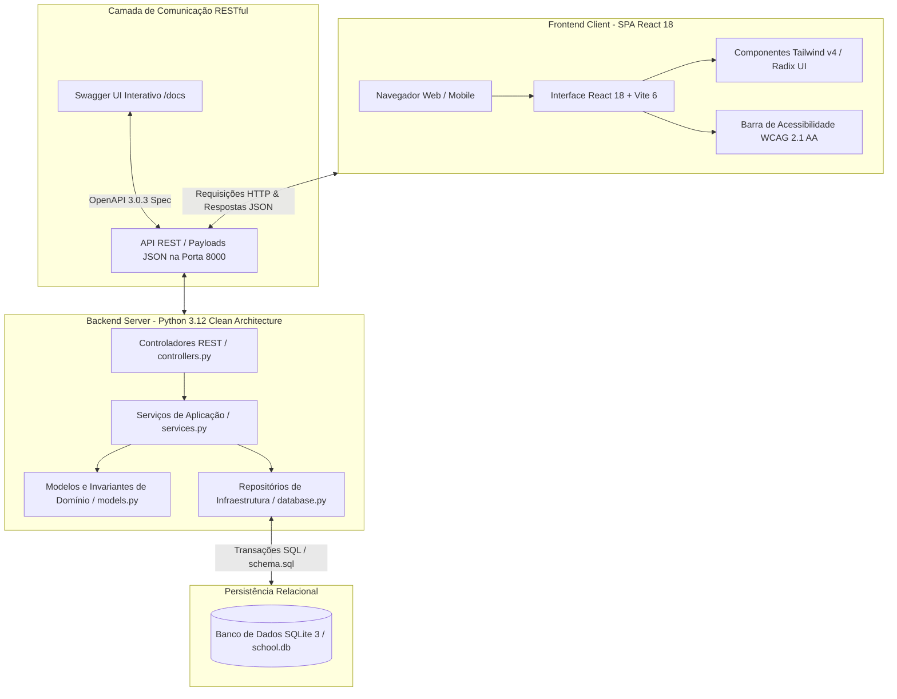
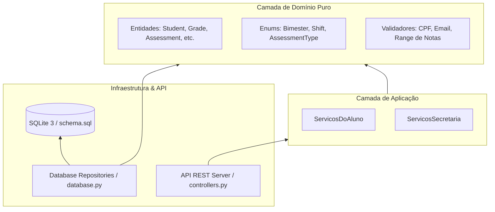
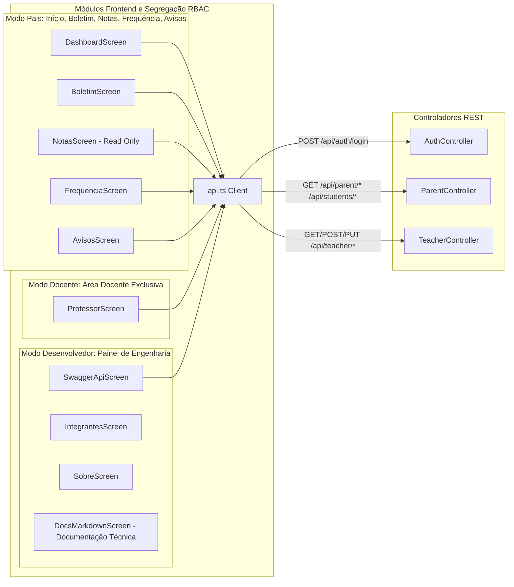
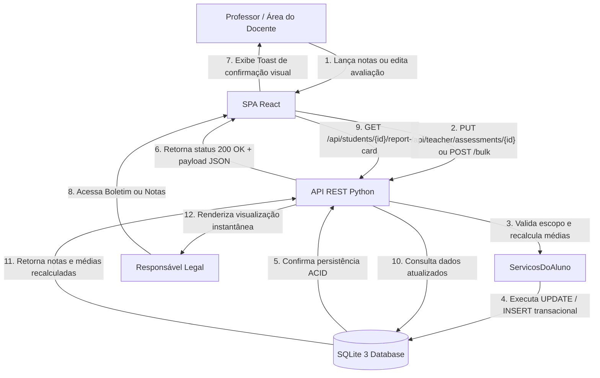
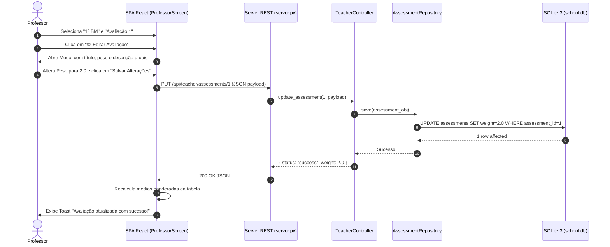
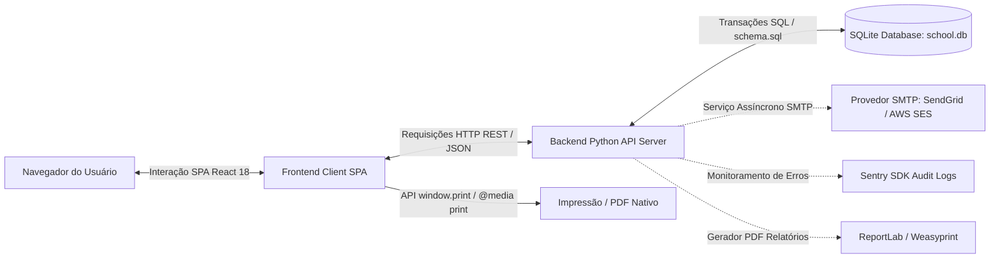

<!-- markdownlint-disable MD013 -->

# TrAcEs — Modelo Arquitetural do MVP Web Funcional (EP3)

**Projeto:** TrAcEs — Trilha de Acompanhamento Estudantil  
**Entregável:** Entregável Parcial 3 (EP3) — Especificação Arquitetural e Manual de Engenharia  
**Disciplina:** Projeto Integrado 3  
**Instituição:** Universidade Federal do Cariri (UFCA)  
**Curso:** Análise e Desenvolvimento de Sistemas  
**Estudantes:** Antonio Alex Dayson Tomaz e Maria Alexsandra Tomaz  
**Data:** 19/08/2026  
**Status da Arquitetura:** ✅ 100% CONSOLIDADA, HOMOLOGADA E TESTADA (79 Testes Aprovados · 18 Endpoints RESTful · OpenAPI 3.0.3 · SQLite 3 · WCAG 2.1 AA)

---

## 1. Visão Geral da Arquitetura

O sistema **TrAcEs (Trilha de Acompanhamento Escolar)** foi projetado como uma plataforma web de alta fidelidade e acessibilidade prática, integrando o ambiente escolar à rotina familiar.

### 1.1 Problema e Contexto

O acompanhamento do rendimento e da assiduidade de estudantes é frequentemente dificultado pelo uso de processos manuais ou planilhas fragmentadas. Essa lacuna impede a ação preventiva de professores e pedagogos e afasta os responsáveis legais do processo educacional. O TrAcEs centraliza, audita e disponibiliza dados acadêmicos com sincronização em tempo real e acessibilidade universal.

### 1.2 Objetivo do MVP Web Funcional

1. **Ambiente Docente Operacional:** Ferramentas ágeis e seguras para entrada de dados em lote (notas e chamada diária), gestão dinâmica de avaliações (`+ Adicionar Avaliação para a Turma` e `✏️ Editar Avaliação`), cálculo automático de médias ponderadas e mural de avisos e comunicados com tags personalizadas.
2. **Ambiente da Família Transparente e Seguro:** Consulta simplificada de boletins dos 4 bimestres, extrato de frequência tátil com motivos de faltas, notas detalhadas com **segregação estrita de papéis (100% somente leitura)** e mural de avisos institucionais com confirmação de leitura instantânea.
3. **Acessibilidade Universal:** Conformidade prática com as diretrizes internacionais **WCAG 2.1 Nível AA** e as **10 Heurísticas de Jakob Nielsen**.

### 1.3 Perfis de Usuários (RBAC)

- **Responsáveis Legais (Família):** Perfil de consulta (`PARENT`). Acesso aos dependentes (*João Silva*, *Ana Silva*, *Pedro Costa*). Interface com alto contraste (7:1), zoom A+/A- e codificação semântica tripla.
- **Corpo Docente (Professores):** Perfil operacional (`TEACHER`). Acesso à seleção de turmas, disciplinas, 3 modos de tabela acadêmica e gestão completa de avisos e comunicados com remetente formal e tags temáticas.
- **Desenvolvedor & Avaliador Técnico (`DEVELOPER`):** Perfil de engenharia e auditoria técnica. Acesso ao painel especializado com 4 menus estruturados: **1. Documentação da API** (Swagger UI integrado via `/docs`), **2. Documentação Técnica** (Leitor com renderização interativa Mermaid e blocos de código com syntax highlighting), **3. Integrantes** (Identificação discente UFCA) e **4. Sobre** (Visão arquitetural e 79 testes).
- **Secretaria e Administração:** Cadastro, enturmação e vinculação socioafetiva N:N entre responsáveis e alunos.

### 1.4 Stack Tecnológico e Justificativa de Engenharia

O ecossistema tecnológico do **TrAcEs (EP3)** foi selecionado sob os pilares da **alta performance**, **acessibilidade digital** e **confiabilidade transacional**:

| Camada | Tecnologia / Ferramenta | Versão | Papel e Justificativa de Engenharia |
| :--- | :--- | :---: | :--- |
| **Frontend Framework** | **React** | `18.3.1` | Biblioteca declarativa baseada em componentes reativos, permitindo a construção de uma Single Page Application (SPA) fluida, com atualizações pontuais via Virtual DOM e sem recargas de página. |
| **Frontend Tooling** | **Vite** | `6.3.5` | Bundler e servidor de desenvolvimento de última geração, oferecendo compilação ultrarrápida (*Hot Module Replacement - HMR*), minificação otimizada para produção, suporte a `host: true` para Codespaces e proxy reverso universal (`/api`, `/docs`, `/openapi.json`). |
| **Linguagem Frontend** | **TypeScript** | `5.x` | Tipagem estática rigorosa que assegura a integridade dos contratos de dados (DTOs e interfaces da API REST), prevenindo falhas de runtime e acelerando a manutenibilidade do código. |
| **Estilização & Design** | **Tailwind CSS** | `4.1.12` | Framework CSS utilitário de alta performance para implementação do Design System, tokens de cores acessíveis, classes de Alto Contraste nativo e folhas de estilo `@media print`. |
| **Componentes UI & Ícones** | **Radix UI & Lucide React** | `1.x / 0.487` | Primitivas acessíveis headless (compatíveis com leitores de tela e navegação por teclado) e conjunto de ícones SVG semânticos para a codificação semântica tripla. |
| **Diagramas Visuais** | **Mermaid.js** | `11.x` | Motor de renderização vetorial SVG interativo para exibição nítida dos diagramas arquiteturais e de sequência no leitor de documentação da SPA. |
| **Backend Core** | **Python (Clean Architecture)** | `3.12+` | Linguagem base para a implementação das 4 camadas da Clean Architecture, encapsulando regras pedagógicas puras e validações invariantes sem dependência de bibliotecas externas pesadas. |
| **Servidor HTTP & API** | **HTTPServer Nativo (RESTful)** | `Python 3.12` | Servidor HTTP com auto-reload inteligente nativo, suporte a CORS, roteamento dinâmico e tratamento de erros padronizado em JSON. |
| **Documentação Interativa** | **OpenAPI & Swagger UI** | `3.0.3` | Padrão global para documentação e teste interativo dos 18 endpoints RESTful diretamente pelo navegador (`/docs` e `/swagger`). |
| **Banco de Dados** | **SQLite** | `3.x` | Banco de dados relacional embarcado de alta performance com conformidade ACID, 12 tabelas físicas, restrições `CHECK` e 11 índices relacionais. |
| **Testes Automatizados** | **Pytest** | `8.x / 9.x` | Framework de testes que executa a suíte de 79 testes automatizados (unitários, integração e E2E) com 100% de aprovação. |

---

## 2. Topologia e Estrutura em Camadas (Clean Architecture)

A aplicação segue o padrão arquitetural **Cliente-Servidor Desacoplado**, implementando **Clean Architecture (4 Camadas no Backend)** e **Single Page Application (SPA)** no frontend:

- **Frontend SPA (Camada View):** Interface desenvolvida em **React 18 (SPA)** com **TypeScript 5**, **Vite 6** e **Tailwind CSS v4** (`frontend/`), utilizando o ecossistema **Shadcn UI / Radix UI Primitives** e **Lucide Icons** para suporte estrito aos requisitos de acessibilidade **WCAG 2.1 AA**, garantindo renderização reativa sem recargas de página e consumo da API REST.
- **Backend RESTful (Clean Architecture em 4 Camadas):** Estruturado em **Python 3.12** (`backend/`), dividindo estritamente as responsabilidades entre Apresentação, Aplicação, Domínio e Infraestrutura, com persistência transacional em **SQLite 3** e documentação interativa viva no padrão **OpenAPI 3.0.3 / Swagger UI**.

```text
┌──────────────────────────────────────────────────────────────────────────┐
│              CAMADA DE VISÃO / APRESENTAÇÃO (Frontend SPA - React 18)    │
│  - Diretório: frontend/                                                  │
│  - Vite 6, TypeScript 5, Tailwind CSS v4, Lucide Icons, Radix UI         │
│  - 6 Telas: Dashboard, Boletim, Notas Detalhadas, Frequência, Avisos,    │
│    Área Docente (com seletores, notas e chamadas em lote)                │
│  - Acessibilidade: Barra WCAG 2.1 AA (Alto Contraste 7:1, Zoom 80%-140%, │
│    Gerenciamento Ativo de Foco, ARIA Live Regions, Focus Trap em Modais) │
└────────────────────────────────────┬─────────────────────────────────────┘
                                     │ Requisições HTTP REST (JSON)
                                     ▼
┌──────────────────────────────────────────────────────────────────────────┐
│              CAMADA DE APRESENTAÇÃO (Presentation Layer - Python 3.12)   │
│  - Diretório: backend/src/presentation/                                  │
│  - server.py: HTTPServer multithreaded assíncrono com CORS na porta 8000 │
│  - controllers.py: AuthController, ParentController, TeacherController   │
│  - serializers.py: Formatação JSON (Decimal, ISO-8601, Enums)            │
│  - openapi_spec.py: 18 Endpoints OpenAPI 3.0.3 / Swagger UI (/docs)      │
└────────────────────────────────────┬─────────────────────────────────────┘
                                     │ Chamadas de Casos de Uso
                                     ▼
┌──────────────────────────────────────────────────────────────────────────┐
│              CAMADA DE APLICAÇÃO & SERVIÇOS (Application Layer)          │
│  - Diretório: backend/src/application/                                   │
│  - services.py:                                                          │
│    ├── ServicosDoAluno: Médias ponderadas, boletins e frequência         │
│    └── ServicosSecretaria: Matrículas e vínculos socioafetivos N:N       │
└────────────────────────────────────┬─────────────────────────────────────┘
                                     │ Invocação de Entidades
                                     ▼
┌──────────────────────────────────────────────────────────────────────────┐
│               CAMADA DE DOMÍNIO & REGRAS PURAS (Domain Layer)            │
│  - Diretório: backend/src/domain/                                        │
│  - models.py:                                                            │
│    ├── Entidades: Student, Teacher, Parent, Classroom, Assessment, Grade │
│    ├── Enums: Bimester, Shift, EducationLevel, AssessmentType            │
│    └── Invariantes: Validador Algorítmico de CPF, Regex RFC 5322 e-mail  │
└────────────────────────────────────┬─────────────────────────────────────┘
                                     │ Padrão Repository
                                     ▼
┌──────────────────────────────────────────────────────────────────────────┐
│           CAMADA DE INFRAESTRUTURA & PERSISTÊNCIA (Infrastructure Layer) │
│  - Diretório: backend/src/infrastructure/                                │
│  - database.py: DatabaseManager thread-safe e 7 Repositórios SQL         │
│  - schema.sql: 12 Tabelas físicas, 11 Índices, ON DELETE CASCADE, CHECKs │
│  - school.db: Banco de dados relacional embarcado SQLite 3               │
└──────────────────────────────────────────────────────────────────────────┘
```

---

## 3. Diagramas Arquiteturais em Mermaid

### 3.1 Diagrama de Arquitetura Geral do Sistema



### 3.2 Diagrama de Camadas do Backend (Clean Architecture)

A dependência de código aponta estritamente de fora para dentro, isolando as regras de negócio:



### 3.3 Diagrama de Componentes e Módulos do Sistema



### 3.4 Diagrama de Fluxo de Integração e Comunicação



### 3.5 Diagrama de Sequência: Edição de Avaliação e Recálculo



---

## 4. Manual de Engenharia da API RESTful (18 Endpoints OpenAPI 3.0.3)

O backend implementa uma API RESTful completa, sem estado, documentada no padrão **OpenAPI 3.0.3** e acessível interativamente via **Swagger UI** (`/docs` e `/swagger`).

### 4.1 Módulo Sistema & Autenticação

#### 1. `GET /api/health`

- **Finalidade:** Healthcheck e diagnóstico do servidor.
- **Resposta `200 OK`:**

  ```json
  {
    "status": "ok",
    "system": "TrAcEs — Trilha de Acompanhamento Estudantil API",
    "version": "1.0.0",
    "docs_url": "/docs",
    "openapi_url": "/openapi.json"
  }
  ```

#### 2. `POST /api/auth/login`

- **Finalidade:** Autenticação de usuários (Responsável ou Docente) com perfil RBAC.
- **Corpo da Requisição:**

  ```json
  {
    "email": "maria.silva@email.com",
    "role": "PARENT"
  }
  ```

- **Resposta `200 OK`:**

  ```json
  {
    "token": "jwt_mock_parent_1",
    "user": {
      "id": 1,
      "name": "Maria Silva Oliveira",
      "email": "maria.silva@email.com",
      "role": "PARENT",
      "dependents": [1, 2, 3]
    }
  }
  ```

---

### 4.2 Módulo do Responsável Legal (Família)

#### 3. `GET /api/parent/dependents`

- **Parâmetros:** `parent_id` (int, opcional, default=1).
- **Finalidade:** Retorna o resumo de médias, assiduidade e flags de risco dos dependentes.
- **Resposta `200 OK`:**

  ```json
  [
    {
      "student_id": 1,
      "name": "João Silva Oliveira",
      "registration": "2024001",
      "classroom": "9º Ano A",
      "shift": "MANHA",
      "average_grade": 7.8,
      "attendance_rate": 91.5,
      "total_absences": 2,
      "alerts": { "critical_attendance": false, "low_grades": false }
    },
    {
      "student_id": 2,
      "name": "Ana Silva Oliveira",
      "registration": "2024002",
      "classroom": "6º Ano B",
      "shift": "MANHA",
      "average_grade": 5.8,
      "attendance_rate": 72.0,
      "total_absences": 8,
      "alerts": { "critical_attendance": true, "low_grades": true }
    },
    {
      "student_id": 3,
      "name": "Pedro Costa Santos",
      "registration": "2024003",
      "classroom": "9º Ano A",
      "shift": "MANHA",
      "average_grade": 8.1,
      "attendance_rate": 95.0,
      "total_absences": 1,
      "alerts": { "critical_attendance": false, "low_grades": false }
    }
  ]
  ```

#### 4. `GET /api/students/{student_id}/report-card`

- **Parâmetros:** `student_id` (caminho, int), `year` (query, int, default=2026).
- **Finalidade:** Boletim consolidado dos 4 bimestres por disciplina, média anual e situação final.

#### 5. `GET /api/students/{student_id}/assessments`

- **Parâmetros:** `student_id` (caminho, int), `subject` (query, string), `year` (query, int).
- **Finalidade:** Notas detalhadas por avaliação (`Avaliação 1`, `Avaliação 2`), pesos, tipos e fórmulas (100% somente leitura).

#### 6. `GET /api/students/{student_id}/attendance`

- **Parâmetros:** `student_id` (caminho, int), `subject` (query, string), `month` (query, int), `year` (query, int).
- **Finalidade:** Extrato mensal de presença e calendário escolar.

#### 7. `GET /api/parent/announcements`

- **Parâmetros:** `student_id` (query, int, opcional), `parent_id` (query, int, opcional).
- **Finalidade:** Mural de comunicados institucionais com categorização de urgência (`URGENT`, `IMPORTANT`, `GENERAL`, `EVENT`), remetente formal com cargo, tags temáticas coloridas e ordenação padrão (1º data mais recente desc, 2º assunto alfabético asc).

#### 8. `POST /api/parent/announcements/{id}/read` *(Novo)*

- **Parâmetros:** `id` (caminho, int).
- **Finalidade:** Confirmação de leitura do comunicado pelo responsável legal, atualizando o status físico no SQLite e refletindo instantaneamente no painel do docente.
- **Resposta `200 OK`:**

  ```json
  {
    "status": "success",
    "announcement_id": 1,
    "is_read": true,
    "message": "Aviso marcado como lido com sucesso."
  }
  ```

---

### 4.3 Módulo do Corpo Docente (Professor)

#### 9. `GET /api/teacher/classes`

- **Parâmetros:** `teacher_id` (query, int, default=1).
- **Finalidade:** Escopo de turmas, disciplinas lecionadas e estudantes matriculados com matrículas.

#### 10. `GET /api/teacher/assessments`

- **Parâmetros:** `subject` (query, string), `bimester` (query, string), `year` (query, int).
- **Finalidade:** Listagem de avaliações sequenciais criadas para a disciplina e bimestre.

#### 11. `PUT /api/teacher/assessments/{id}`

- **Parâmetros:** `id` (caminho, int).
- **Corpo da Requisição:**

  ```json
  {
    "title": "Avaliação 1",
    "assessment_type": "PROVA",
    "weight": 2.0,
    "description": "Álgebra e Equações do 2º Grau"
  }
  ```

- **Resposta `200 OK`:**

  ```json
  {
    "status": "success",
    "assessment_id": 1,
    "title": "Avaliação 1",
    "weight": 2.0,
    "type": "PROVA",
    "message": "Avaliação 'Avaliação 1' atualizada com sucesso!"
  }
  ```

#### 12. `POST /api/teacher/assessments/add`

- **Finalidade:** Criação sequencial de nova avaliação para toda a turma sem exigir notas imediatas no pop-up.
- **Corpo da Requisição:**

  ```json
  {
    "student_id": 1,
    "subject": "Matemática",
    "bimester": "PRIMEIRO",
    "academic_year": 2026,
    "title": "Avaliação 2",
    "assessment_type": "TRABALHO",
    "weight": 1.5,
    "score": 0.0,
    "description": "Trabalho em Grupo de Geometria",
    "graded_by": "Prof. Carlos Mendes"
  }
  ```

#### 13. `POST /api/teacher/grades/bulk`

- **Finalidade:** Lançamento e publicação em lote de notas dos alunos para a avaliação selecionada.

#### 14. `POST /api/teacher/attendance/bulk`

- **Finalidade:** Registro de chamada diária/mensal em lote por disciplina e turma, suportando marcações integrais (`2P`), parciais (`1P 1F`), faltas (`2F`), faltas justificadas com atestado (`2FJ`) e campos em branco (`""` / sem registro).
- **Corpo da Requisição:**

  ```json
  {
    "date": "2026-03-02",
    "subject": "Matemática",
    "classroom_id": 1,
    "records": [
      { "student_id": 1, "is_present": true, "justification": null },
      { "student_id": 2, "is_present": true, "justification": "Atestado médico" }
    ]
  }
  ```

#### 15. `GET /api/teacher/announcements` *(Novo)*

- **Parâmetros:** `classroom_id` (query, int, opcional), `teacher_id` (query, int, opcional).
- **Finalidade:** Listagem de avisos e comunicados gerenciados pelo corpo docente com status de leitura pelos responsáveis.

#### 16. `POST /api/teacher/announcements` *(Novo)*

- **Finalidade:** Cadastro e publicação de novos avisos no mural para toda a turma, aluno específico ou geral da escola, com remetente formal (`sender_role`), tags padrão e criador de tags personalizadas com paleta de cores.
- **Corpo da Requisição:**

  ```json
  {
    "title": "Recuperação Paralela de Álgebra",
    "content": "Aulas de apoio às terças e quintas-feiras.",
    "category": "IMPORTANT",
    "sender_role": "PROFESSOR",
    "sender_name": "Prof. Carlos Mendes",
    "target_type": "CLASSROOM",
    "classroom_id": 1,
    "subject": "Matemática",
    "tags": [{"label": "Recuperação", "color": "#DC2626", "bg": "#FEF2F2"}]
  }
  ```

#### 17. `PUT /api/teacher/announcements/{id}` *(Novo)*

- **Parâmetros:** `id` (caminho, int).
- **Finalidade:** Edição e atualização de avisos previamente cadastrados pelo docente.

---

## 5. Arquitetura da Área do Docente (`ProfessorScreen`)

A interface do docente foi desenhada para eliminar erros de lançamento e oferecer máxima produtividade:

```text
┌──────────────────────────────────────────────────────────────────────────┐
│ SELEÇÃO DE ESCOPO E TIPO DE REGISTRO                                     │
│ [Turma: 9º Ano A] [Disciplina: Matemática]                               │
│ [Tipo de Registro: Notas / Avaliações | Frequência Diária | Avisos]      │
│ [Bimestre/Visão: 1º BM | 2º BM | 3º BM | 4º BM | Consolidado]            │
│ [Avaliação: Avaliação 1 | Avaliação 2 | ... | Todas]                     │
└──────────────────────────────────────────────────────────────────────────┘
```

### 5.1 Modos Especializados de Gestão e Lançamento

1. **Modo Avaliação Específica (`isSpecificAssessmentMode`):**
   - Ativado quando o docente seleciona um bimestre individual (`1º BM` a `4º BM`) **E** uma avaliação específica (`Avaliação 1`, etc.).
   - **Colunas:** `ESTUDANTE`, `MATRÍCULA`, `AVALIAÇÃO`, `TIPO`, `DESCRIÇÃO`, `PESO` e `NOTA` (campo editável de 0.0 a 10.0).
   - **Botões Disponíveis:** `+ Adicionar Avaliação para a Turma` e `✏️ Editar Avaliação`.
2. **Modo Todas as Avaliações com Peso (`isBimesterAllMode`):**
   - Ativado quando o docente seleciona um bimestre individual **E** a opção `Todas`.
   - **Colunas:** `ESTUDANTE`, `MATRÍCULA`, `AVALIAÇÃO 1 (Peso: 1.5)`, `AVALIAÇÃO 2 (Peso: 2.0)`, ..., `MÉDIA PONDERADA` e `SITUAÇÃO` (`APROVADO` se $\ge 6.0$ / `RECUPERAÇÃO` se $< 6.0$).
   - **Natureza:** Somente Leitura (consolidação instantânea do bimestre).
3. **Modo Consolidado Anual (`isConsolidatedMode`):**
   - Ativado quando o seletor de bimestre está em `Consolidado`.
   - **Colunas:** `ESTUDANTE`, `MATRÍCULA`, `1º BM`, `2º BM`, `3º BM`, `4º BM`, `MÉDIA GERAL` e `SITUAÇÃO ANUAL` (`APROVADO` se $\ge 6.0$, `RECUPERAÇÃO` se $\ge 4.0$, `REPROVADO` se $< 4.0$).
   - **Natureza:** Somente Leitura (visão holística do ano letivo).
4. **Modo Gestão de Avisos e Comunicados:**
   - Ativado quando o docente seleciona `Avisos e Comunicados` no seletor *Tipo de Registro*.
   - **Colunas:** `TÍTULO E RESUMO`, `DESTINATÁRIO`, `EMISSOR / REMETENTE`, `PRIORIDADE & TAGS`, `DATA DE PUBLICAÇÃO`, `STATUS DE LEITURA` (`✓ Lido pelo Responsável` com timestamp ou `⏳ Aguardando Leitura`), `AÇÕES` (`✏️ Editar`).
   - **Funcionalidades:** Modal de criação sem tags pré-selecionadas, criador de tags customizadas com paleta de 7 cores e ordenação automática por data mais recente e ordem alfabética.

---

## 6. Modelo Físico de Banco de Dados (SQLite 3)

O banco relacional `school.db` é composto por **12 tabelas normalizadas** e **11 índices de alta performance**:

```text
TABELAS FÍSICAS (12):
├── students (id, registration, name, email, cpf, created_at)
├── parents (id, name, email, phone, cpf, address)
├── teachers (id, name, email, cpf, registration)
├── classrooms (id, name, shift, education_level, academic_year, teacher_id)
├── classroom_enrollments (student_id, classroom_id, enrolled_at)
├── student_parent (student_id, parent_id, relationship_type)
├── teacher_subjects (teacher_id, subject, academic_year)
├── assessments (assessment_id, title, type, weight, bimester, subject, academic_year)
├── grades (grade_id, student_id, assessment_id, score, graded_by, graded_at)
├── attendance (attendance_id, student_id, subject, date, status, notes)
├── announcements (announcement_id, title, content, category, sender_role, sender_name, sender, target_type, classroom_id, student_id, tags, is_read, read_at, date_published)
└── report_cards (report_id, student_id, academic_year, consolidated_data)
```

---

## 7. Decisões Arquiteturais e Justificativas de Engenharia

A arquitetura de software do **TrAcEs** foi estruturada sob os pilares da engenharia moderna de software:

### 7.1 Separação Frontend/Backend (Arquitetura Desacoplada)

- **Decisão:** Divisão estrita entre a interface de apresentação (SPA em React 18 no cliente) e o servidor de processamento de regras (Python 3.12 no backend).
- **Justificativa de Manutenção:** Equipes de desenvolvimento podem evoluir a interface do usuário no React sem impactar as regras puras da camada de domínio do Python.
- **Justificativa de Desempenho:** Toda a computação visual e renderização da DOM ocorrem localmente no dispositivo do usuário. O tráfego de rede é estritamente limitado à troca de dados estruturados em JSON, reduzindo a latência e liberando processamento no servidor.

### 7.2 Arquitetura em Camadas (Clean Architecture) no Backend

- **Decisão:** Divisão em 4 camadas com fluxo de dependências direcionado unicamente para o centro (`Domain` $\leftarrow$ `Application` $\leftarrow$ `Infrastructure` $\leftarrow$ `API`).
- **Justificativa de Organização:** O domínio puro (`models.py`) desconhece bancos de dados ou frameworks HTTP. As regras de cálculo de média e lançamento estão encapsuladas na camada de aplicação (`services.py`).
- **Justificativa de Escalabilidade:** Se houver necessidade futura de substituir o banco de dados embarcado SQLite por um cluster relacional em nuvem (ex: PostgreSQL ou MySQL), a alteração será restrita unicamente aos arquivos de infraestrutura em `database.py`, mantendo 100% da lógica acadêmica intocada.

### 7.3 Uso de APIs RESTful sem Estado (HTTP / JSON)

- **Decisão:** Comunicação padronizada baseada em verbos HTTP semânticos (`GET`, `POST`, `PUT`) e payloads JSON.
- **Justificativa de Segurança:** Permite aplicar políticas consistentes de CORS (*Cross-Origin Resource Sharing*) e cabeçalhos de segurança na API.
- **Justificativa de Interoperabilidade:** Permite que futuros clientes móveis nativos (Android/iOS) consumam exatamente a mesma API RESTful sem necessidade de reescrever serviços de backend.

### 7.4 Estrutura de Monolito Modular

- **Decisão:** Organização em repositório único dividindo logicamente os módulos escolares em pastas desacopladas, em vez de microsserviços distribuídos.
- **Justificativa de Simplicidade Operacional:** Para o escopo do MVP, o monolito modular elimina a complexidade de redes distribuídas e latências inter-serviços, permitindo implantação simples e manutenção limpa.

### 7.5 Integridade do Banco de Dados Relacional

- **Decisão:** Utilização do SQLite 3 com chaves estrangeiras ativas (`FOREIGN KEY ... ON DELETE CASCADE`), restrições de verificação (`CHECK`) e índices de busca.
- **Justificativa de Consistência:** Garante que a consistência lógica definida no Python tenha uma contrapartida física no nível de armazenamento, impedindo notas órfãs ou cadastros duplicados.

### 7.6 Coexistência e Sincronização de Documentação (`docs/` vs `frontend/public/docs/`)

- **Decisão:** Manutenção da pasta mestre `docs/pi3-ep3-atual/` na raiz do repositório e espelhamento estático em `frontend/public/docs/pi3-ep3-atual/`.
- **Justificativa de Engenharia e Usabilidade:**
  - **`docs/pi3-ep3-atual/` (Na Raiz do Repositório):** Atua como a **Fonte da Verdade da Documentação Técnica Oficial**, versionada no Git para leitura no GitHub, avaliação acadêmica e consultas no editor de código.
  - **`frontend/public/docs/pi3-ep3-atual/` (No Frontend SPA):** Atua como **Ativo Estático da Web**. O Vite só disponibiliza arquivos para o navegador via requisições HTTP (`fetch()`) se estiverem dentro do diretório `public/`. A tela **Modo Desenvolvedor $\rightarrow$ Documentação Técnica** dentro da SPA React (`App.tsx`) realiza `fetch(/docs/pi3-ep3-atual/${docKey})` para carregar e renderizar na íntegra todos os 8 documentos técnicos com formatação rica e suporte a LaTeX diretamente na interface visual.

| Diretório | Natureza | Papel | Hash SHA-256 |
| :--- | :--- | :--- | :---: |
| **`docs/pi3-ep3-atual/`** | Documentação do Repositório | **Fonte da Verdade** oficial do projeto (arquivos mestre). | ✅ 100% Sincronizado |
| **`frontend/public/docs/pi3-ep3-atual/`** | Ativo Estático da Web | **Cópia de Distribuição** para o leitor de documentação da interface web React. | ✅ 100% Sincronizado |

### 7.7 Localização do Arquivo de Configuração `pytest.ini` na Raiz

- **Decisão:** Manutenção unificada do arquivo `pytest.ini` exclusivamente na raiz do repositório, com `norecursedirs = .venv node_modules frontend .git`, `testpaths = backend/tests` e `pythonpath = backend`.
- **Justificativa de Engenharia:**
  - **Isolamento de Diretórios:** Impede a varredura desnecessária e poluição de arquivos de cache em pastas do frontend (`node_modules/` e `dist/`).
  - **Injeção de PYTHONPATH:** Assegura que o interpretador Python reconheça o pacote `backend` universalmente para importação dos módulos das 4 camadas (`src.domain`, `src.application`, `src.infrastructure`, `src.presentation`).
  - **Usabilidade na Avaliação Acadêmica:** O professor e a banca avaliadora executam a bateria completa de 79 testes diretamente da raiz com um único comando (`python -m pytest`), sem necessidade de navegar manualmente de diretório.

### 7.8 Arquitetura de Roteamento Universal (Local, GitHub Codespaces & Docker)

- **Decisão:** O backend Python escuta em `0.0.0.0:8000` (`HOST = os.getenv("HOST", "0.0.0.0")`), o Vite opera com `server: { host: true }` e o proxy reverso intercepta `/api`, `/docs` e `/openapi.json`.
- **Justificativa de Portabilidade:**
  - **Eliminação de `ERR_CONNECTION_REFUSED` em Contêineres:** Em ambientes de nuvem e contêineres virtuais (como GitHub Codespaces e VS Code Remote), URLs absolutas como `http://127.0.0.1:8000/docs` apontam indevidamente para a máquina física do cliente. Ao adotar URLs relativas (`/docs`, `/openapi.json`) com proxy do Vite, todo o tráfego é roteado internamente de forma transparente.
  - **Execução Híbrida sem Reconfiguração:** O mesmo código-fonte roda sem nenhuma alteração manual tanto no ambiente de desenvolvimento local (Windows/Linux/macOS) quanto em contêineres remotos ou pipelines de CI/CD.

---

## 8. Integrações do Sistema e Serviços de Infraestrutura Futura

As integrações do **TrAcEs** foram projetadas para atender ao MVP e suportar expansão sem acoplamento:



1. **Persistência SQL Local Transacional (Ativa):**
   - Repositórios desacoplados em `database.py` operando com transações ACID no `school.db`.
2. **Serviço SMTP de Alertas Preventivos por E-mail (Infraestrutura Futura):**
   - **Finalidade:** Disparo automático de alertas para os responsáveis quando a frequência do aluno cair abaixo do limite crítico (75%) ou notas em recuperação forem lançadas.
   - **Desenho Arquitetural:** Módulo assíncrono em `application/services.py` conectado a provedores SMTP (SendGrid / AWS SES) acionado no momento da publicação das notas ou chamadas pelo professor.
3. **API de Exportação Física e Geração de PDF (Ativa e Planejada):**
   - **Execução no Frontend (Ativa):** API nativa do navegador (`window.print()`) acoplada a regras CSS de impressão (`@media print`) no `BoletimScreen` para geração de relatórios limpos sem cabeçalhos de tela.
   - **Serviço no Backend (Planejada):** Endpoint `GET /api/reports/report-card/{id}/pdf` integrado às bibliotecas `ReportLab` ou `Weasyprint` para geração de documentos PDF oficiais com chancela digital.
4. **Módulo de Registro de Auditoria e Logs com Sentry (Infraestrutura Futura):**
   - **Finalidade:** Rastreamento de alterações sensíveis de notas e auditoria de ações do corpo docente (RBAC).
   - **Desenho Arquitetural:** Middleware de logging integrado ao Python `logging` e SDK do *Sentry* para monitoramento de exceções e trilha de auditoria em produção.

---

## 9. Aplicação Formal das 10 Heurísticas de Usabilidade de Jakob Nielsen

O design da interface gráfica no Frontend SPA foi validado sob as **10 Heurísticas de Usabilidade de Jakob Nielsen**:

1. **Visibilidade do Estado do Sistema (Heurística #1):**
   - Feedback visual imediato na Área do Docente (`ProfessorScreen`). Inputs de nota alteram a cor da borda instantaneamente para verde (nota válida) ou vermelha (nota inválida). Notificações *Toast* azuis/verdes confirmam o sucesso de edições e publicações.
2. **Correspondência entre o Sistema e o Mundo Real (Heurística #2):**
   - A tela de *Boletim Escolar* simula o layout tabular clássico das cadernetas escolares físicas. Linguagem simples, acessível e isenta de jargões técnicos de banco de dados.
3. **Controle e Liberdade do Usuário (Heurística #3):**
   - Botões proeminentes "⬅️ Voltar ao Painel" em todas as telas secundárias, permitindo desfazer fluxos de navegação. Modais podem ser fechados a qualquer momento clicando no botão "Cancelar" ou pressionando a tecla `Escape`.
4. **Consistência e Padronização (Heurística #4):**
   - Identidade visual uniforme em toda a SPA. A Barra de Acessibilidade, o Cabeçalho com o seletor de dependentes e o Rodapé institucional permanecem idênticos em todas as 6 telas.
5. **Prevenção de Erros (Heurística #5):**
   - Antes de publicar notas ou chamadas diárias no SQLite, o sistema exige a confirmação do professor em um **modal de diálogo obrigatório** que resume o impacto da ação.
6. **Reconhecimento em vez de Memorização (Heurística #6):**
   - Legendagem fixa no rodapé das tabelas indicando as faixas de notas e status (`✓ Aprovado (≥ 6.0) | ⚠️ Recuperação (< 6.0)`), desobrigando o usuário de memorizar regras pedagógicas.
7. **Flexibilidade e Eficiência de Uso (Heurística #7):**
   - O professor conta com 5 seletores de escopo em cascata (*Turma* $\rightarrow$ *Disciplina* $\rightarrow$ *Registro* $\rightarrow$ *Bimestre* $\rightarrow$ *Avaliação*) para alternar agilmente entre visualizações analíticas e de lançamento.
8. **Design Estético e Minimalista (Heurística #8):**
   - Layouts limpos, tipografia legível (Inter, Source Serif 4) e amplo uso de espaços em branco, evitando a sobrecarga cognitiva para responsáveis e professores.
9. **Auxílio aos Usuários para Reconhecer, Diagnosticar e Recuperar-se de Erros (Heurística #9):**
   - Mensagens de erro claras em tempo real abaixo dos campos de nota ("Insira uma nota numérica válida entre 0.0 e 10.0") em cor de alto contraste.
10. **Ajuda e Documentação (Heurística #10):**
    - Botão permanente de ajuda no menu de atalhos e seções de FAQ informativas para os responsáveis sobre o cálculo da média ponderada e regras de assiduidade.

---

## 10. Acessibilidade Digital (WCAG 2.1 AA) e Garantia da Qualidade

### 10.1 Diretrizes WCAG 2.1 AA Implementadas

- **Contraste de Cores (WCAG 1.4.3):** Relação de contraste mínima de $4,5:1$ no tema padrão e $\ge 7:1$ no tema de Alto Contraste nativo.
- **Codificação Semântica Tripla (WCAG 1.4.1):** A informação é transmitida por cor contrastante, ícone SVG e texto explicativo (essencial para usuários daltônicos).
- **Redimensionamento Tipográfico (WCAG 1.4.4):** Seletor A+/A- com escala relativa em `rem` permitindo ampliação de 80% a 140% sem quebrar o layout.
- **Teclabilidade e Skip Links (WCAG 2.4.1):** Todos os componentes interativos do Radix UI são navegáveis via teclado (`Tab`, `Arrows`, `Escape`) e incluem links de salto rápido para `#main-content`, `#main-nav` e `#footer`.

### 10.2 Suíte de Testes Automatizados no `pytest` (79 Testes)

- **Cobrança Total:** 79 testes cobrindo unitariamente modelos, invariantes de CPF, serviços de notas, repositórios SQL transacionais e os 18 endpoints RESTful (incluindo testes de CRUD e confirmação de leitura em `test_announcement_crud_and_read_status` e recálculo dinâmico em `test_edit_assessment_and_recalculate`).
- **Tempo de Execução:** 100% de aprovação em ~3.3 segundos.
